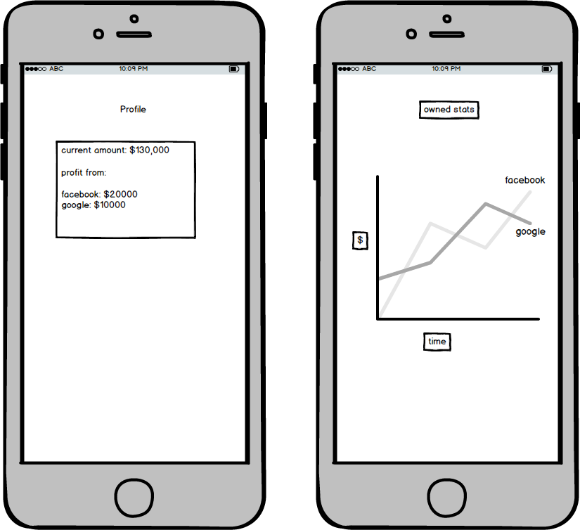

# Stocky

## Background
  Stocky is a mobile application in which users can trade/sell stock
at real-world prices with fake money. It is a fun game, that can also
give users a safe way to experiment in trading stock. 

## Minimum Viable Product
The mechanics of the game will be the following:
- [ ] Auth with phone / email / facebook
- [ ] Users start with a sum of money ($100,000)
- [ ] Stock can be bought/sold
- [ ] The prices of stock will reflect the actual real-world value
- [ ] User index page - display all stocks which user have bought and balance.
- [ ] Leaderboard - display the best players.
BONUS
- [ ] Users might setup push notifications if price of any stock changed by X
- [ ] Achievements
- [ ] Custom Stocks (followers of twitter account of some public person etc)

## Wireframes

## Technologies
Stocky will be a mobile application. The back end will be built with
Ruby on Rails. The front end will use JavaScript and React Native. Google
Finance API will be used to request the real-world stock prices.

## Group Members
Our group consist of three members: Dan (Dong) Kim, Igor Dmitriev, and Joe Thomas.

## Implementation Timeline
**Day 1:** Backend setup and Front End User Auth

**Day 2:** Stock model, API, and Components

**Day 3:** Buy, Sell, Update Users

**Day 4:** Leaderboards, Visualizations (D3 or something else)

**Day 5:** Bonus or finish up the flex project
